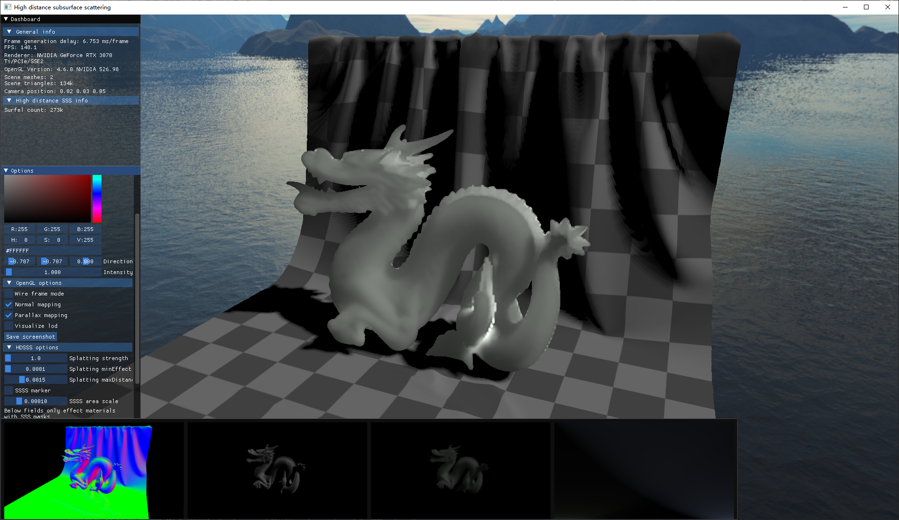
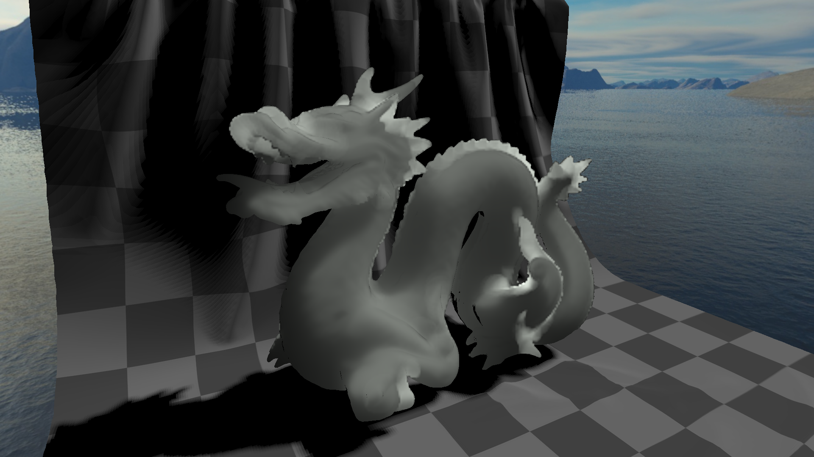
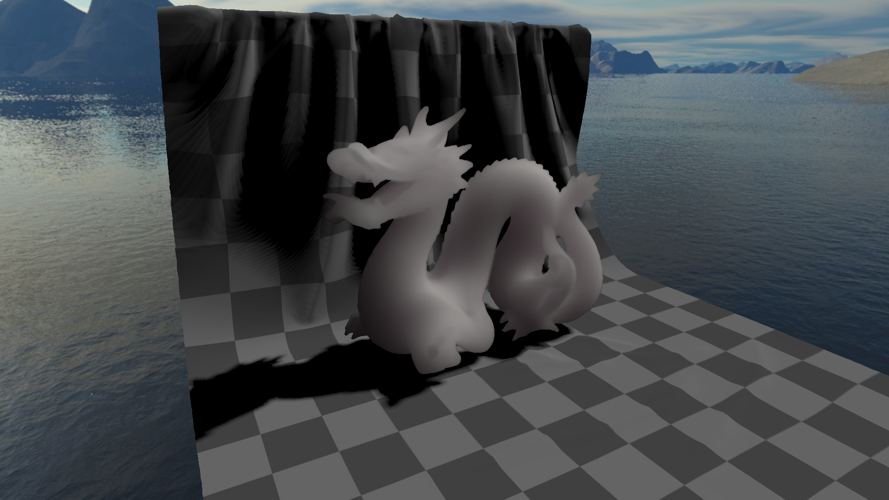

# HDSSS: High Distance Subsurface Scattering

My non-official implementation of the paper [Interactive Subsurface Scattering for Materials With High Scattering
Distances](https://viscom.publications.uni-ulm.de/api/uploads/201/cgf2020.pdf).

**Update 2023/05/08** I port [Deep Screen Space](https://resources.mpi-inf.mpg.de/DeepScreenSpace/) to this implementation to deliver a more straightforward contrary with the HDSSS method.

## Compilation

The project is managed with [XMake](https://xmake.io/), which is a cross-platform build utility. To compile the project, you need to install XMake first. Then, run the following command in the root directory of the project to configure the project(on Windows):

```bash
xmake f -p windows -a x64 -m release -c
```

After that, run the following command to compile the project:

```bash
xmake -w HDSSS
```

Execute the binary directly or use xmake to run it:

```powershell
xmake r HDSSS -s 0.01 -b "D:\\Assets\\skybox" "D:\\Assets\\glTF-Sample-Models-master\\2.0\\DragonAttenuation\\glTF\\DragonAttenuation.gltf"
```

## Usage

```bash
HDSSS --help 
Usage: HDSSS [-h] [--scaling VAR] [--skybox VAR] model

Positional arguments:
  model         Model file path

Optional arguments:
  -h, --help    shows help message and exits
  -v, --version prints version information and exits
  -s, --scaling Scaling factor of the model [default: 1]
  -b, --skybox  Skybox directory, name the six faces as [front|back|left|right|top|bottom].jpg
```

### Camera Control

HDSSS enables usage of an FPS camera to navigate the scene:

- use `WASD` to move
- hold `RMB` an drag your mouse to see around
- scroll your `mouse wheel` to zoom in/out(fov change)

Every time you exit the program, the camera params will be saved in `camera.bin`, and will be loaded next time you run the program.

### Material Control

Due to multiple factors, I failed to see an agreement in common model/material file format on the BSSRDF material parameters, so I decided to directly hard-code the material parameters in the source code.

HDSSS **only** apply subsurface effect to those materials with volume factors > 0, such as `KHR_materials_volume.attenuationColor` and `attenuationDistance` in GLTF volume extensions.

However, if you want to change subsurface parameters, you have to modify the source code, where in `hdsss/src/PBRMaterial.cpp`, you can look for the following code:

```cpp
std::shared_ptr<PBRMetallicMaterial> convertPBRMetallicMaterialFromBaseMaterial(
    const loo::BaseMaterial& baseMaterial) {
    const auto& pbrMetallic = baseMaterial.mrWorkFlow;
    const vec3 marblesigmaA = vec3(0.0021, 0.0041, 0.0071),
               marblesigmaS = vec3(2.19, 2.62, 2.00);
               ...
```

where you can modify the `marblesigmaA` and `marblesigmaS` that really apply to your model, I use marble as an example here. 

Apart from those two, another important parameter **eta** is distributed in two files(line number could be different with further development, but you can always search for `eta` in those two files):

- `hdsss/shaders/include/subsurface.glsl`, Line 11: `float eta = 1.3;`
- `hdsss/src/BSSRDF.cpp`, Line 210: `double eta = 1.3;`

### Other parameters



I provide user-friendly GUI with `ImGui` for misc parameter control, run the program and explore it freely.

To be noticed, there is a "Screenshot" button in the GUI, which will save the current frame to a file, see the console output for the filename.

## Project Structure

- `loo`: A lightweight OpenGL wrapper, which is a submodule of this project, but you can ignore it at most of the time.
- `hdsss`: The main project, which contains the following subdirectories:
  - `shaders`: GLSL shaders, all files named with `[pass].[shader_stage]`.
  - `spv2hpp`: A tool to convert SPIR-V binary to C++ header file, which is a submodule of this project, but you can ignore it at most of the time.
  - `test`: Unittests.
  - `include`: Header files, **important**.
  - `src`: Main source code, **important**:
    - `main.cpp`: Entry point.
    - `HDSSSApplication.cpp`: Main application class, which organize the 7 passes of the rendering pipeline, **important**.
    - `BSSRDF.cpp`: BSSRDF kernel pre-integration, **important**.
    - `FinalProcess.cpp`: Screen final pass, merging the result of previous passes, and do stuffs like tone mapping and gamma correction.

## Screenshot

High Distance Subsurface Scattering:



Deep Screen Space Subsurface Scattering:


